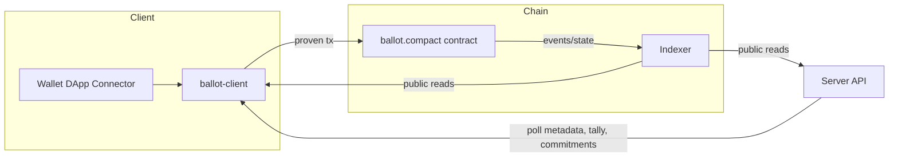
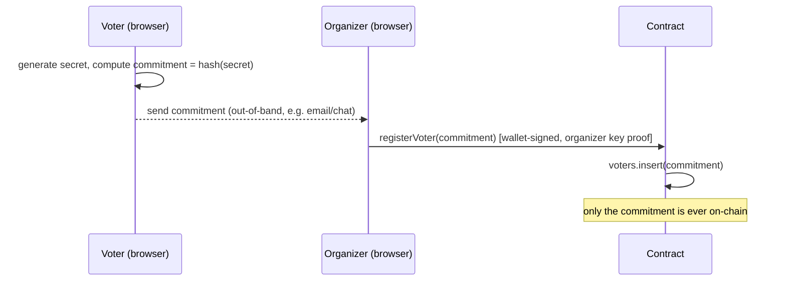
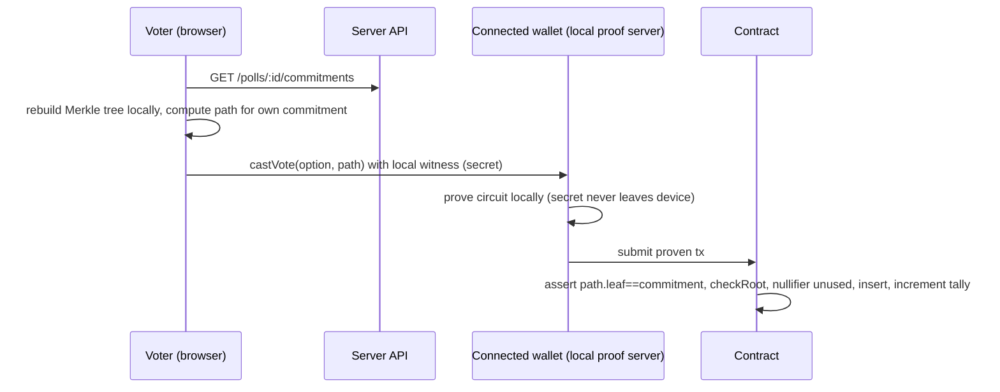
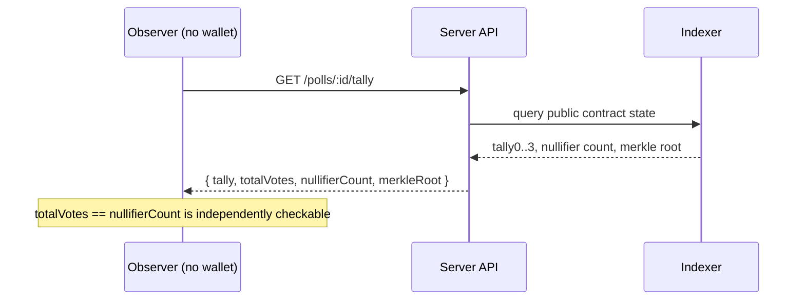
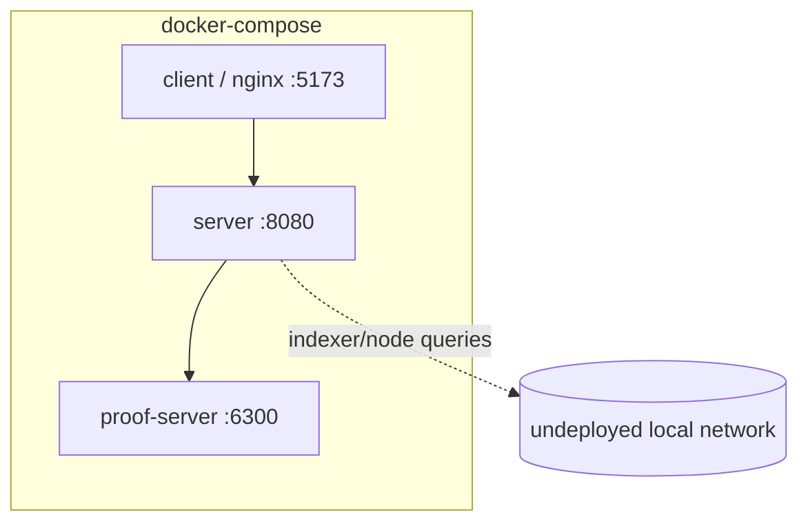

# Architecture

## Three parts

```
packages/
├── contracts/   Compact contract + witnesses + vitest suite (source of truth for on-chain rules)
├── shared/      chain config, zod schemas, providers, ballot-client — imported by server & client
├── server/      Fastify API: poll metadata, read-only indexer queries, optional DUST sponsorship
└── client/      Vite+React UI: wallet connect, organizer/voter/results pages
```

Boundary rule: `server` never imports a voter secret or witness; all proving happens in
`client` via the connected wallet. `shared` has no server- or browser-only code — it's plain
TS + the generated contract types.

## Data flow



The server is a read-only convenience layer over the indexer plus a small off-chain metadata
store (poll titles/options); it never mediates a write to the contract except optionally
adding DUST fee inputs to an already-proven tx (sponsorship).

## Sequence: register a voter



## Sequence: cast a vote



## Sequence: read the tally



## Why HistoricMerkleTree, not MerkleTree

`checkRoot` on a plain `MerkleTree` only accepts the *current* root. If a voter fetches
commitments and computes a path, then the organizer registers one more voter before the
voter's `castVote` lands on-chain, the root changed and a plain-tree path would be rejected —
forcing a retry and creating a race. `HistoricMerkleTree.checkRoot` accepts any root the tree
has ever held, so a path computed against an older root stays valid. See `docs/DECISIONS.md`.

## Deployment topology (dev)



The browser talks to the extension wallet directly (not through `docker-compose`'s
proof-server) for anything that touches voter secrets — see `docs/THREAT_MODEL.md`.
